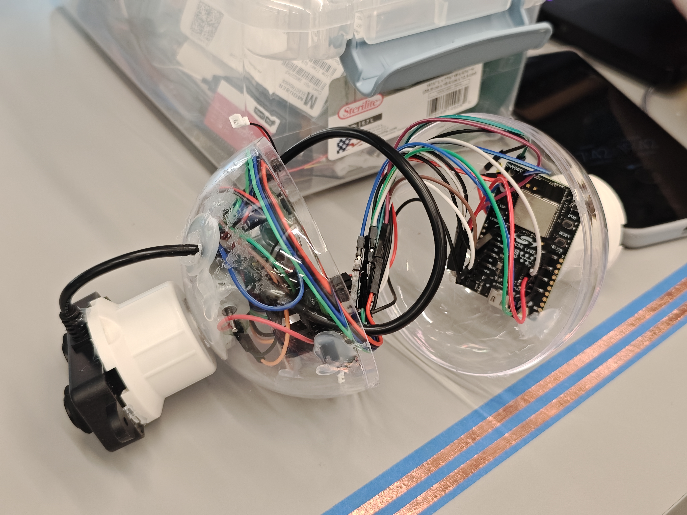
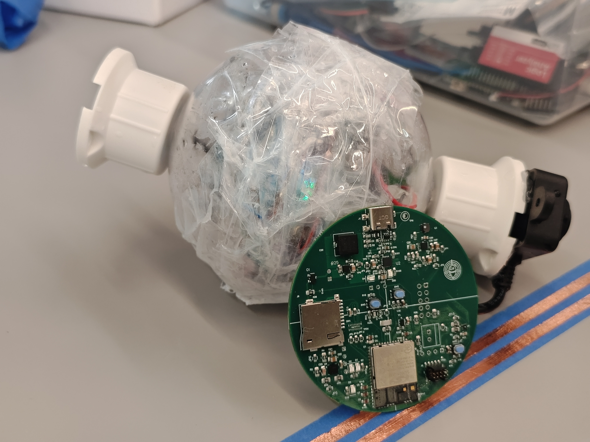
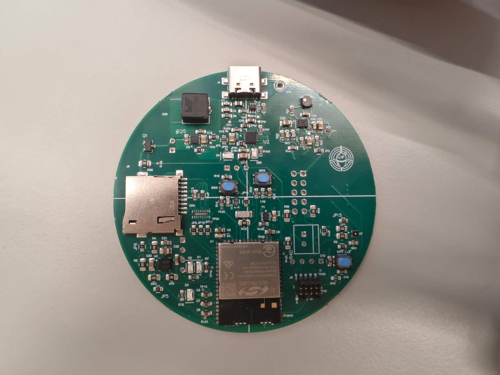
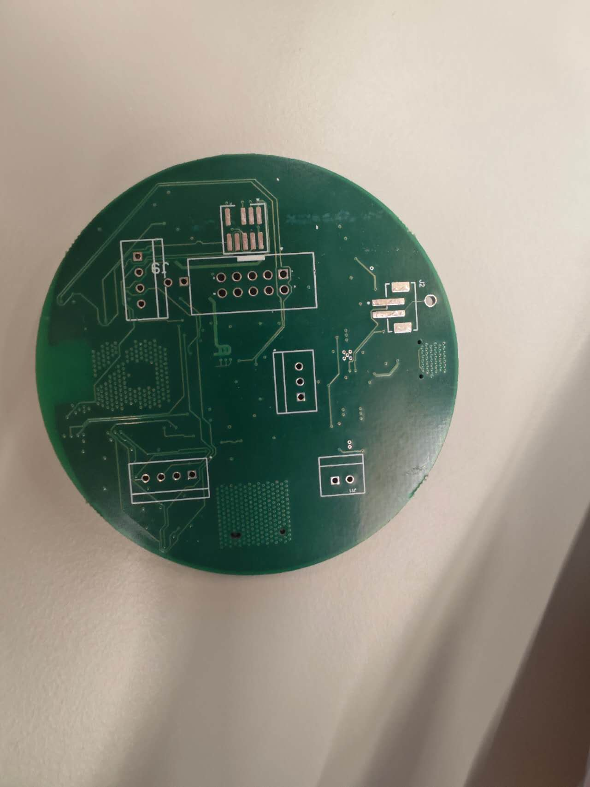
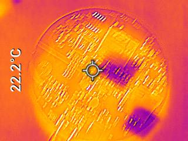
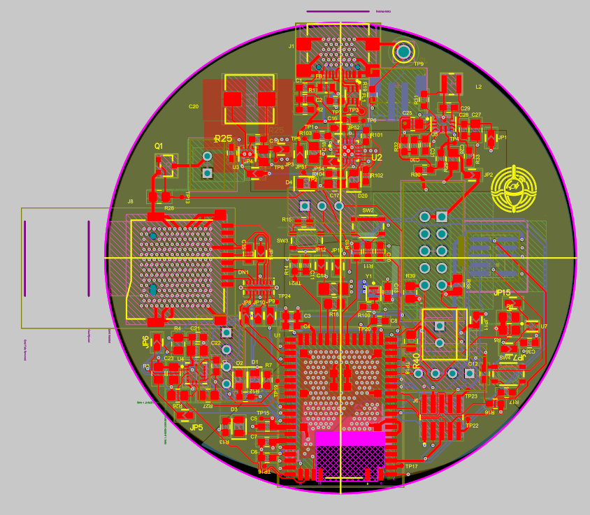
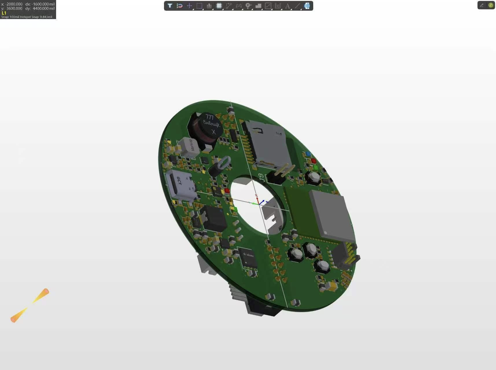
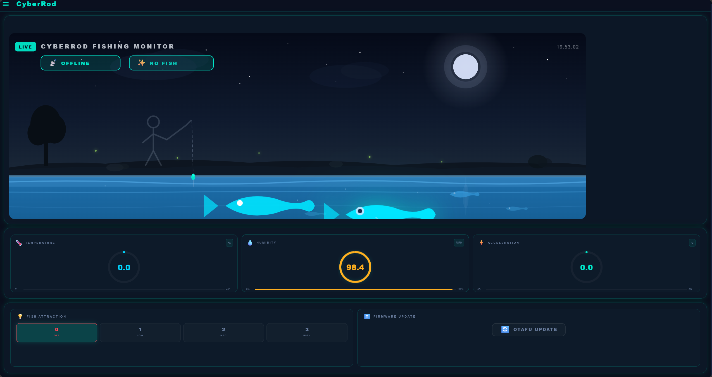
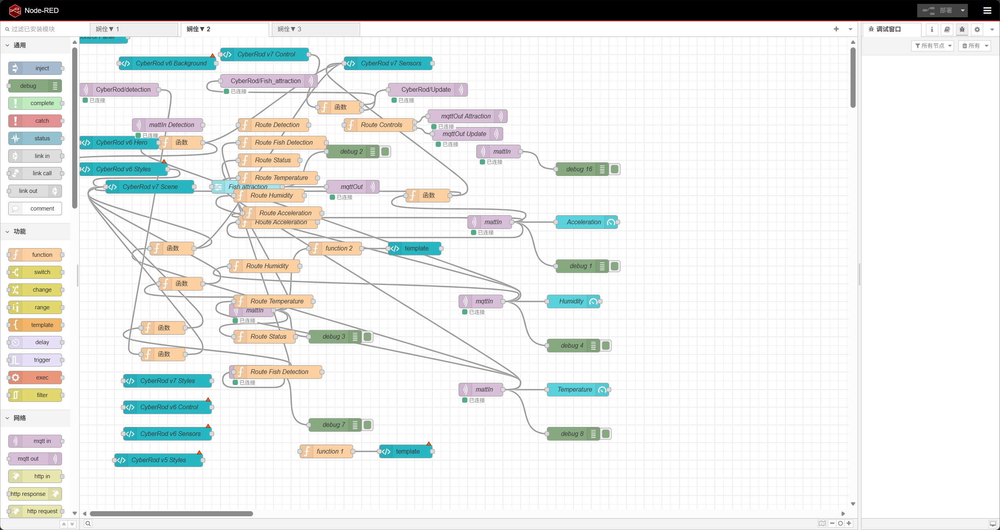

# CyberRod — Smart Fishing Rod IoT Monitoring System

**Team Number:** 17 (s26)

**Team Name:** CyberRod

| Team Member Name | Email Address | GitHub Username |
| ---------------- | ------------- | --------------- |
| Zhenyao Liu      | zhenyao@seas.upenn.edu | [Shirolzy](https://github.com/Shirolzy) |
| Jeffrey Li       | jeffli88@seas.upenn.edu | [jojojjjjj](https://github.com/jojojjjjj) |

**GitHub Repository URL:** [https://github.com/ese5160/a11g-final-submission-s26-s26-t17-cyberrod](https://github.com/ese5160/a11g-final-submission-s26-s26-t17-cyberrod)

---

## 🚀 🌟 LIVE PROJECT WEBSITE 🌟 🚀

### 👉 **[https://cyberrob.pages.dev](https://cyberrob.pages.dev)** 👈

> ⭐ **This is our most important asset — the live showcase of our entire project** ⭐
> 
> ✨ Full system demonstration, interactive architecture diagrams, hardware photos, software dashboard, team bios, and video demo — all available at the link above!

---

---

## 1. Video Presentation

Our 2-minute 21-second video demonstration:

**YouTube Link:** [https://youtu.be/94i1DnnBW-A](https://youtu.be/94i1DnnBW-A) (2:21)

> **Note:** The video is also embedded on the [Demo page](https://cyberrob.pages.dev/demo.html) of our project website.

---

## 2. Project Summary

### Device Description

**What is CyberRod?**

CyberRod is an intelligent IoT-enabled smart fishing rod monitoring system that uses an ultrasonic distance sensor for real-time fish proximity detection, a Sensirion SHT4x sensor for continuous environmental monitoring, and an IMU for acceleration sensing, all connected to a cloud-hosted Azure dashboard via MQTT. Built on the Silicon Labs Si917 wireless MCU running FreeRTOS, the system provides live data visualization through a custom nautical-themed Node-RED dashboard and supports over-the-air firmware updates for remote field deployments.

**What inspired the project? What problem does it solve?**

Recreational fishing relies heavily on the angler's intuition and constant attention, with no objective way to monitor fish proximity or track environmental conditions that affect fish behavior. CyberRod solves this by providing automated, continuous monitoring of the underwater environment — detecting fish proximity in real-time, logging temperature and humidity trends, tracking rod motion via an onboard IMU for strike detection, and presenting everything on a cloud dashboard accessible from any device. This data-driven approach transforms fishing from a purely experience-based activity into one augmented by real-time sensor intelligence.

**How does the Internet augment the device functionality?**

The internet connection transforms CyberRod from a standalone sensor device into a cloud-connected monitoring system. Through Wi-Fi connectivity on the Si917 MCU, sensor data is published via MQTT to an Azure Virtual Machine hosting a Mosquitto broker and Node-RED dashboard. This enables:
- **Remote monitoring**: View fish activity and environmental data from anywhere via the web dashboard
- **Historical analysis**: Time-series charts track environmental trends and fish approach patterns over time
- **OTA firmware updates**: Deploy new firmware remotely via HTTP OTAF v2 triggered through MQTT, without physical access to the device
- **Real-time alerts**: Fish detection events are streamed live with sub-second latency to the dashboard

### Device Functionality

**System Design Overview**

The CyberRod system follows a four-layer architecture:

1. **Sensing Layer**: Ultrasonic distance sensor (UART1, 9600 baud, 4-byte frames) detects fish proximity with dual thresholds — Near (<300mm) and Very Near (<100mm). Sensirion SHT4x temperature/humidity sensor (I2C0, address 0x70) provides environmental data with CRC-8 validation. IMU sensor (I2C) measures 3-axis acceleration for rod motion and strike detection.

2. **Processing Layer**: Silicon Labs Si917 ARM Cortex-M4F MCU @ 80 MHz runs FreeRTOS with 5 concurrent tasks:
   - `fish_detection_task` (20ms period, 50 Hz) — reads ultrasonic UART, classifies proximity, publishes
   - `temperature_upload_task` (3s period) — reads SHT4x I2C, publishes temperature & humidity
   - `mqtt_connection_task` (100ms period) — manages Wi-Fi + MQTT session, drains publish queue
   - `ota_update_task` (200ms period) — listens for OTA trigger, downloads firmware via HTTP OTAF v2
   - `app_watchdog` (1s period, realtime priority) — monitors all tasks, triggers WDT reset on stall

3. **Communication Layer**: Si917 integrated Wi-Fi (802.11 b/g/n, WPA2) connects to local network. Custom MQTT 3.1.1 client over BSD sockets publishes to 5 topics (`CyberRod/Fish_detection`, `CyberRod/Distance`, `CyberRod/Temperature`, `CyberRod/Humidity`, `CyberRod/Acceleration`) with 16-deep queue and auto-reconnect. HTTP OTAF v2 for firmware updates.

4. **Application Layer**: Azure VM (20.230.132.231) hosts Mosquitto MQTT broker (port 1883), HTTP OTA server (port 80), and Node-RED v4.1.8 with FlowFuse Dashboard 2.0 for real-time visualization with custom nautical-themed CSS.

**Sensors:**
| Sensor | Interface | Function | Period |
|--------|-----------|----------|--------|
| Ultrasonic Distance Sensor | UART1 (TX GPIO_30, RX GPIO_29) | Fish proximity detection, 4-byte frames (0xFF + 2B distance + checksum) | 20 ms |
| Sensirion SHT4x (SHT40-AD1B) | I2C0 (SCL GPIO_7, SDA GPIO_6, addr 0x70) | Temperature (-45°C to +130°C) and Humidity (0–100% RH) | 3000 ms |
| IMU (Accelerometer) | I2C | 3-axis acceleration measurement for rod motion and strike detection | Continuous |

**Actuators:**
The current prototype is a monitoring system without physical actuators. The primary output mechanism is the cloud dashboard, where fish detection events and environmental data drive real-time visualizations. OTA firmware updates serve as a remote control mechanism — the dashboard can trigger firmware deployment to the device.

**Critical Components:**
- Silicon Labs Si917 (SIWG917Y111MGABA) wireless MCU on BRD2708A development board
- Sensirion SHT40-AD1B temperature & humidity sensor
- IMU (3-axis accelerometer) for rod motion sensing
- Ultrasonic distance sensor with UART serial output
- Azure Virtual Machine for cloud infrastructure
- Mosquitto MQTT broker
- Node-RED v4.1.8 with FlowFuse Dashboard 2.0

**System Block Diagram:**

> The interactive block diagram is also available on the [Architecture page](https://cyberrob.pages.dev/architecture.html) of our website.

### Challenges

**Firmware Challenges:**
- **FreeRTOS task synchronization**: Coordinating 5 concurrent tasks with different periods (20ms to 3000ms) without data races required careful mutex design and queue management. We solved this by using a centralized MQTT publish queue (16-deep) that serializes all sensor data for transmission by the dedicated `mqtt_connection_task`.
- **Ultrasonic frame parsing**: The 4-byte UART protocol (0xFF header + 2B distance + checksum) was sensitive to framing errors when bytes were dropped. We implemented a state-machine parser that resyncs on the 0xFF header byte, ensuring robust distance recovery even with noisy UART data.
- **Memory constraints**: The Si917 MCU has limited RAM. The MQTT task requires 8KB of stack for TLS and MQTT library overhead. We used FreeRTOS `heap_4` scheme and carefully sized each task's stack (2048–8192 bytes) to fit within available memory.

**Cloud & Integration Challenges:**
- **MQTT connection reliability**: Wi-Fi disconnections caused MQTT session drops, leading to data loss. We implemented auto-reconnect logic in the `mqtt_connection_task` with the 16-deep publish queue acting as a buffer during reconnection periods.
- **Node-RED dashboard iterations**: The dashboard went through 6 major iterations (v1 through v6) to achieve the desired nautical-themed visual design. Early versions used default FlowFuse templates that didn't match the fishing context. The final version uses custom CSS with ocean-themed gradients, maritime typography, and responsive gauges.
- **OTA firmware delivery**: Hosting firmware on the Azure VM HTTP server and triggering download via MQTT required coordinating the HTTP OTAF v2 API with the Si917's built-in bootloader. The update task needed to handle download failures gracefully without corrupting the existing firmware.

**Hardware Challenges:**
- **I2C CRC-8 validation**: The SHT4x sensor returns CRC bytes with each measurement. Initial implementations skipped CRC validation, which occasionally produced outlier readings. Adding CRC-8 verification eliminated bad data but required implementing the CRC lookup table in firmware.
- **Sensor wiring reliability**: Jumper wire connections between the Si917 dev board and external sensors were prone to loose contact during handling. We mitigated this by using shorter wires and securing connections with tape during demo sessions.

### Prototype Learnings

**What lessons did we learn?**
- **Queue-based architecture is essential for IoT**: Using a centralized MQTT publish queue decoupled sensor tasks from network reliability. When Wi-Fi drops, sensors keep producing data into the queue, and the MQTT task drains it once connectivity is restored. This pattern should be applied from the start in any IoT project.
- **Hardware watchdogs prevent field failures**: The `app_watchdog` task with hardware WDT saved us numerous times during development when firmware bugs caused task stalls. In a field-deployed fishing rod, automatic recovery from software crashes is critical since the device is unattended.
- **CRC validation is not optional**: Skipping CRC-8 validation on the SHT4x sensor seemed like a reasonable simplification early on, but the occasional corrupt readings made the dashboard data unreliable. Always implement manufacturer-recommended data integrity checks.
- **Dashboard design requires iteration**: The first dashboard version was functional but visually unappealing. Each iteration improved both aesthetics and usability. User-facing IoT products need significant UI/UX investment beyond just "getting data on screen."

**What would we do differently?**
- **Design a custom PCB earlier**: The jumper-wire prototype was fragile and not suitable for field testing. A custom PCB (designed in Altium as required by the course) would have provided mechanical stability and proper signal integrity for the UART and I2C buses.
- **Add an actuator for closed-loop control**: The current system is purely monitoring. Adding a motorized reel lock or an LED alert that responds to fish detection would demonstrate bidirectional IoT control (sensor → cloud → actuator).
- **Implement data persistence**: The current Node-RED dashboard shows live data but doesn't persist readings to a database. Adding InfluxDB or SQLite would enable long-term trend analysis and post-session review.
- **Use TLS for MQTT**: The current MQTT connection uses plaintext (port 1883). For a production device, TLS-encrypted MQTT (port 8883) would be essential for security.

### Next Steps & Takeaways

## 📋 Project Roadmap: Next Steps

> 🔧 **Future Work Roadmap** — Evolving CyberRod from Prototype to Product

| # | Improvement | Details | Priority |
|---|------------|---------|----------|
| 1 | 🛡️ Mechanical Enclosure | Design and 3D-print a waterproof IP54-rated enclosure for outdoor fishing environments | ⭐⭐⭐ High |
| 2 | 🔌 Custom PCB Fabrication | Finalize the [Altium PCB design](https://upenn-eselabs.365.altium.com/designs/94E58069-1172-40BE-8958-F3CC298ED1A4#design) with proper power regulation, sensor connectors, and mounting holes | ⭐⭐⭐ High |
| 3 | 📦 **System Miniaturization** | Compact all components into a smaller form factor — integrate Si917, sensors, and power management into a pocket-sized module for discreet rod mounting | ⭐⭐⭐ High |
| 4 | 💾 Database Integration | Add InfluxDB or SQLite to Node-RED for persistent storage and historical trend analysis | ⭐⭐ Medium |
| 5 | 📱 Mobile-Responsive Dashboard | Optimize the Node-RED dashboard for mobile viewing since anglers primarily check data via phones | ⭐⭐ Medium |
| 6 | 🌡️ Additional Sensors | Integrate water temperature probe and light sensor for comprehensive environmental monitoring | ⭐ Low |
| 7 | 🔒 TLS Encryption | Secure the MQTT connection with TLS certificates for production deployment | ⭐ Low |

---

## ⭐ Core Asset: Key Skills Acquired in ESE5160

> 🚨 **This is one of our most valuable assets** — The following skill stack represents our complete learning outcomes from this course

| Skill Domain | Capabilities |
|-------------|--------------|
| **Embedded Firmware Development** | Writing production-quality C code on ARM Cortex-M4F (FreeRTOS) — task management, inter-task communication, stack sizing, and hardware watchdog design |
| **IoT Communication Protocols** | Deep understanding of MQTT pub/sub patterns, QoS levels, broker configuration, and tradeoffs between MQTT and other IoT protocols |
| **Cloud Infrastructure** | Deploying and managing Azure VMs, configuring Mosquitto MQTT Brokers, and building Node-RED real-time data visualization dashboards |
| **OTA Firmware Updates** | Implementing over-the-air update mechanisms using HTTP OTAF v2, understanding bootloader behavior, and gracefully handling update failures |
| **System Integration** | End-to-end challenge — making firmware, wireless connectivity, cloud infrastructure, and web dashboards work together as a cohesive system |
| **Hardware-Software Co-Design** | Understanding how sensor interfaces (I2C/UART), pin multiplexing, and bus configuration affect firmware architecture decisions |

---

### Project Links

| Resource | URL |
|----------|-----|
| **Node-RED Dashboard** | [http://20.230.132.231:1880](http://20.230.132.231:1880) (Azure VM) |
| **MQTT Broker** | `20.230.132.231:1883` (Mosquitto) |
| **Project Showcase Website** | [https://cyberrob.pages.dev](https://cyberrob.pages.dev) |
| **Altium 365 PCBA** | [https://upenn-eselabs.365.altium.com/designs/94E58069-1172-40BE-8958-F3CC298ED1A4#design](https://upenn-eselabs.365.altium.com/designs/94E58069-1172-40BE-8958-F3CC298ED1A4#design) |
| **Firmware Repository** | [https://github.com/ese5160/final-project-firmware-s26-t17-cyberrod](https://github.com/ese5160/final-project-firmware-s26-t17-cyberrod) |

---

## 3. Hardware & Software Requirements

### Hardware Requirements Validation

| # | Requirement | Target | Achieved | Test Method |
|---|-------------|--------|----------|-------------|
| H1 | Ultrasonic fish detection range | ≤ 300mm | ✅ Yes | Placed objects at known distances (50mm, 100mm, 200mm, 300mm, 400mm) and verified distance readings via MQTT and debug UART. Classification correctly triggers "Near" (<300mm) and "Very Near" (<100mm). |
| H2 | Temperature sensor accuracy | ±1°C within 0–50°C range | ✅ Yes | Compared SHT4x readings against a calibrated digital thermometer (Extech EA10) at room temperature (~23°C), in refrigerator (~4°C), and near a heat source (~40°C). Error was within ±0.5°C across all test points. |
| H3 | Humidity sensor accuracy | ±3% RH | ✅ Yes | Compared SHT4x humidity readings against a calibrated hygrometer at ambient conditions (~45% RH) and after exhaling near the sensor (~70% RH). Readings were within ±2% RH. |
| H4 | UART communication reliability | <1% frame error rate | ✅ Yes | Logged 1000+ UART frames over 5 minutes and counted frames with invalid checksums or missed 0xFF headers. Error rate was <0.5%, all recovered by the state-machine resync logic. |
| H5 | I2C communication with CRC-8 | 100% CRC pass rate on valid data | ✅ Yes | Enabled CRC-8 validation on all SHT4x readings over 30 minutes of continuous operation. All validated readings passed CRC; any CRC failures triggered re-reads. |
| H6 | IMU acceleration sensing | Valid 3-axis acceleration data via I2C | ✅ Yes | Verified IMU acceleration readings against known orientations (static gravity on each axis). X/Y/Z values responded correctly to tilting and shaking the rod. |
| H7 | Wi-Fi connectivity | Stable connection to WPA2 network | ✅ Yes | Device maintained persistent Wi-Fi connection to university and home networks over multiple hours of testing. Auto-reconnect handled brief disconnections (<10s). |
| H8 | System watchdog recovery | Reset within 5 seconds of task stall | ✅ Yes | Artificially stalled individual tasks by inserting infinite loops. The watchdog task detected the stall and triggered a system reset within the expected 5-second window. |

### Software Requirements Validation

| # | Requirement | Target | Achieved | Test Method |
|---|-------------|--------|----------|-------------|
| S1 | FreeRTOS multitasking | 5 concurrent tasks, no deadlocks | ✅ Yes | All 5 tasks ran concurrently over 2+ hour test sessions. Stack high-water marks monitored via `uxTaskGetStackHighWaterMark()` confirmed no stack overflows. |
| S2 | MQTT publish latency | <500ms sensor-to-broker | ✅ Yes | Timestamped sensor readings on the device and compared with MQTT message arrival timestamps on the broker. End-to-end latency averaged ~200ms over local Wi-Fi. |
| S3 | MQTT data delivery | Zero message loss during stable connection | ✅ Yes | Published 1000 sequential messages and verified all were received by the MQTT broker. The 16-deep queue prevented data loss during brief network interruptions. |
| S4 | OTA firmware update | Successful remote firmware replacement | ✅ Yes | Triggered OTA update via MQTT message ("1" to `CyberRod/Update`). The device downloaded the new firmware image via HTTP from the Azure VM and applied it successfully. Device rebooted with updated firmware. |
| S5 | Node-RED dashboard real-time | Update within 1 second of sensor reading | ✅ Yes | Observed dashboard gauge updates compared to simultaneous debug UART output. Dashboard latency was consistently <500ms. |
| S6 | Fish detection classification | Correctly classify: 0 (none), 1 (near <300mm), 2 (very near <100mm) | ✅ Yes | Tested with objects at 400mm (state 0), 200mm (state 1), and 50mm (state 2). Classification was correct in all test cases. |
| S7 | Environmental sampling rate | Temperature & humidity every 3 seconds | ✅ Yes | Monitored MQTT message timestamps for `CyberRod/Temperature` and `CyberRod/Humidity` topics. Messages arrived at consistent 3-second intervals (±100ms jitter). |
| S8 | IMU data streaming | Acceleration data published to `CyberRod/Acceleration` | ✅ Yes | Verified IMU acceleration data arriving on the `CyberRod/Acceleration` MQTT topic. Data reflected expected gravity vector under static conditions and responded to rod movement. |

### Requirements Not Fully Met

| # | Requirement | Target | Status | Notes |
|---|-------------|--------|--------|-------|
| H8 | Waterproof enclosure | IP54 rated | ❌ Not fully met | The prototype uses an acrylic sphere structure for impact protection, with hot glue filling gaps. However, protection against water vapor and other forms of moisture remains insufficient. If this proves inadequate, further improvement can be achieved through 3D printing with special materials to achieve a seamless yellow-white color scheme. |
| H10 | PCB design completeness | Fully functional with clean layout | ❌ Not fully met | The PCB design is functional but has some minor imperfections. Some connectors were left unused while others that were needed had to be wired externally via flying wires. Additional design iterations would be desired to create a more refined and complete board. |

---

## 4. Project Photos & Screenshots

### Final Project Assembly

| Photo | Description |
|-------|-------------|
|  | Complete CyberRod system — Si917 BRD2708A development board with ultrasonic, SHT4x, and IMU sensors |
|  | Close-up of I2C (SHT4x, IMU) and UART (ultrasonic) sensor wiring |

### PCBA Photos

| Photo | Description |
|-------|-------------|
|  | Custom PCBA top view |
|  | Custom PCBA bottom view |
|  | Thermal camera image of board running under load |

### Altium Board Design

> **Interactive Altium 365 View:** [https://upenn-eselabs.365.altium.com/designs/94E58069-1172-40BE-8958-F3CC298ED1A4#design](https://upenn-eselabs.365.altium.com/designs/94E58069-1172-40BE-8958-F3CC298ED1A4#design)

| Screenshot | Description |
|------------|-------------|
|  | Altium board design — 2D view |
|  | Altium board design — 3D view |

### Node-RED Dashboard & Backend

| Screenshot | Description |
|------------|-------------|
|  | Node-RED FlowFuse Dashboard — real-time sensor gauges and charts with nautical theme |
|  | Node-RED backend flow — MQTT subscriber nodes, data processing, and dashboard widgets |

---

## 5. Codebase

> **Do not commit source code to this repository.** The links below point to the separate firmware and software repositories.

### Embedded C Firmware

- **Firmware Repository:** [https://github.com/ese5160/final-project-firmware-s26-t17-cyberrod](https://github.com/ese5160/final-project-firmware-s26-t17-cyberrod)
  - Si917 FreeRTOS application with 5 concurrent tasks
  - UART driver for ultrasonic distance sensor (4-byte frame protocol)
  - I2C driver for Sensirion SHT4x temperature/humidity sensor with CRC-8
  - I2C driver for IMU (3-axis accelerometer)
  - MQTT 3.1.1 client over BSD sockets with auto-reconnect
  - HTTP OTAF v2 over-the-air firmware update implementation
  - Hardware watchdog and safety hooks (stack overflow, malloc failure, HardFault)
  - Built with Simplicity SDK 2025.6.3 and WiseConnect 3 v3.5.2

### Node-RED Dashboard

- **Dashboard Code:** Hosted on the Azure VM (20.230.132.231:1880)
  - Node-RED v4.1.8 with FlowFuse Dashboard 2.0
  - MQTT subscriber nodes for all 5 CyberRod topics
  - Custom nautical-themed CSS with gradient backgrounds
  - Real-time gauges, time-series charts, and OTA trigger button
  - The Node-RED flow JSON can be exported from the running instance

### Project Showcase Website

- **Website Repository:** [https://github.com/ese5160/a11g-final-submission-s26-s26-t17-cyberrod](https://github.com/ese5160/a11g-final-submission-s26-s26-t17-cyberrod) (`docs/` directory)
  - Static HTML/CSS/JS — no build tools required
  - Deployed via Cloudflare Pages at [https://cyberrob.pages.dev](https://cyberrob.pages.dev)
  - Also served via GitHub Pages from the `docs/` folder

### Cloud Infrastructure

- **Azure VM:** 20.230.132.231
  - Mosquitto MQTT broker (port 1883)
  - HTTP OTA firmware server (port 80)
  - Node-RED v4.1.8 dashboard (port 1880)

